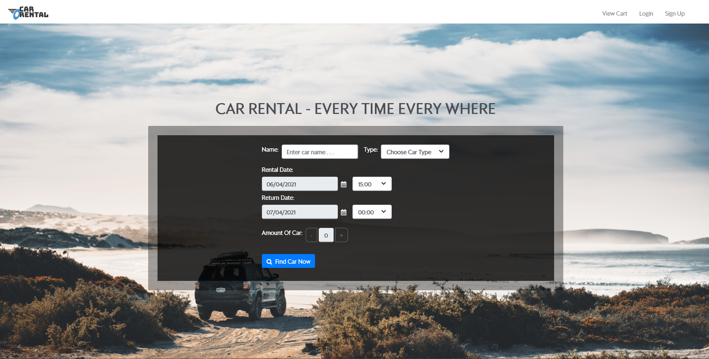
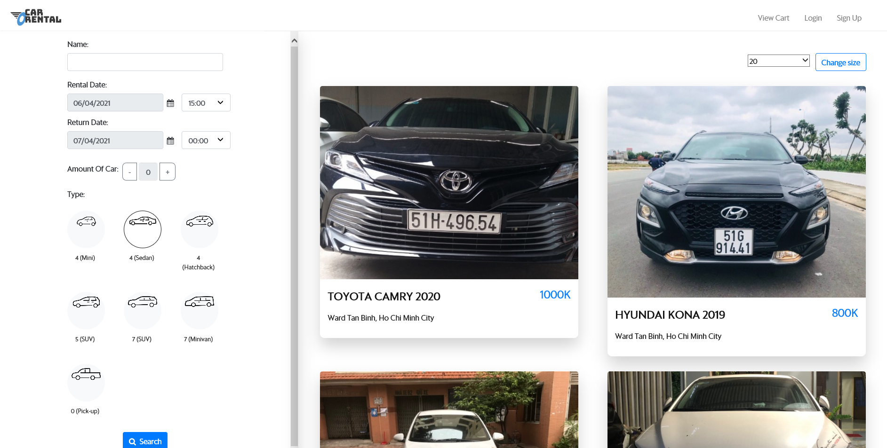
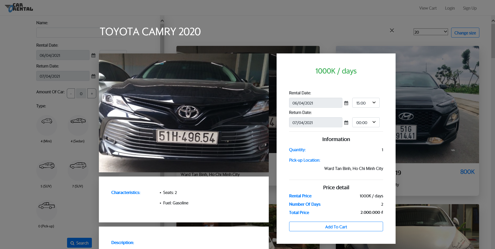
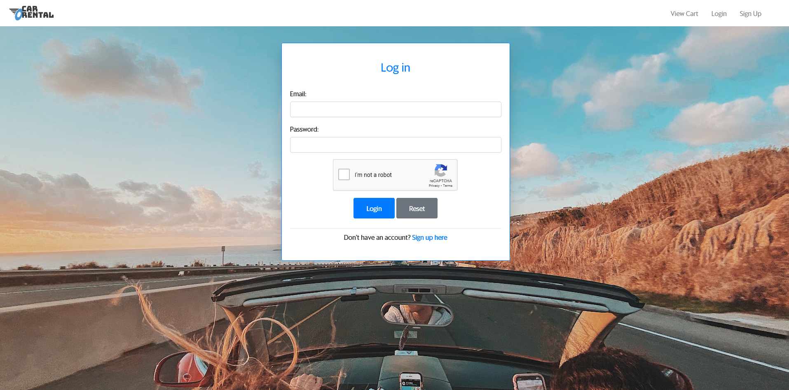
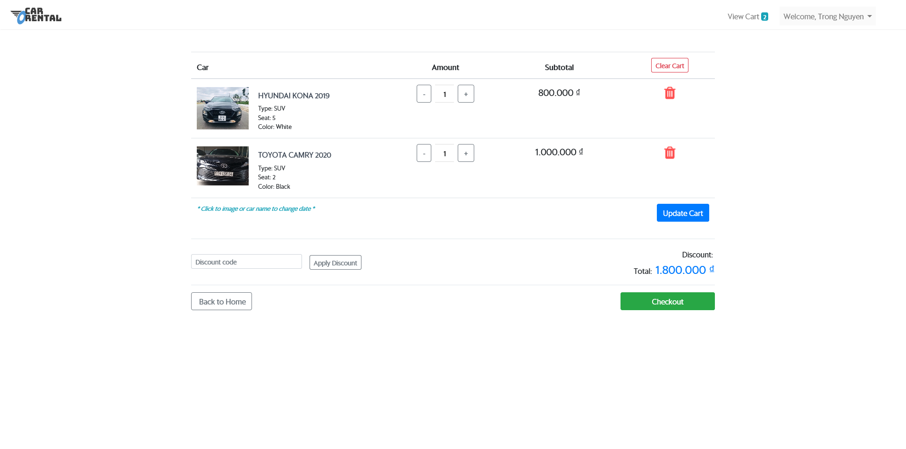
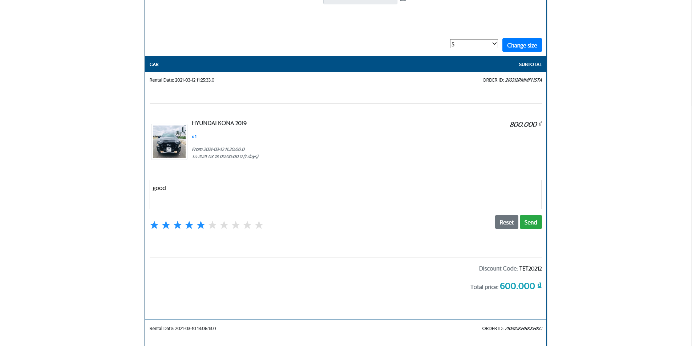

<h1 align="center">Car Rental</h1>

## Description 
- A java web app that allows users to book cars to travel with specific rental dates and return dates.

  

## Technicals
- Java Web Application
- Java Servlet and JSP service
- Apache Tomcat 8.0.27.0
- Netbean IDE 8.2 RC
- SQL Server

---

# Demo

## **Home page**

  

## **Search page**

  

## **View Detail**

  

## **Login page**

  

## **Cart page**

  

## **Feedback**

  

***

✨ *Thank you for visiting* ✨
